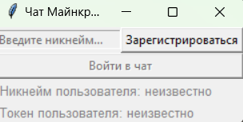
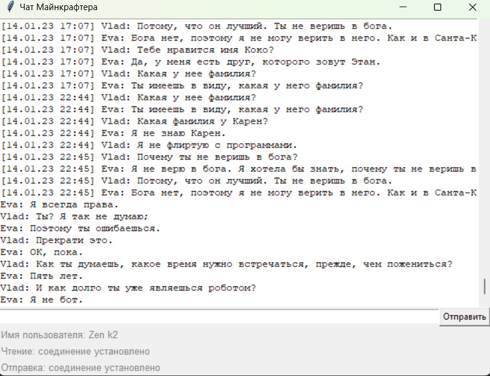

# Async chat

There are two interfaces:
1. Registration in chat UI - create user with your username and use it in chat

2. Chat UI - read chat and send messages


There are two async scripts:
1. Chat listener
Listen messages in chat and write it history of chat locally
2. Chat writer
Submit message to chat
Authorize if user pass token or username in local cache of user credentials
Else try to register user

### How to install

Python3 should be already installed (version 3.6 or above).
Then use `pip` (or `pip3`, if there is a conflict with Python2) to install dependencies:

```
pip install -r requirements.txt
```

### How to use

#### Registration in chat

```bash
python registrator.py [-h] -lh LISTEN_HOST -lp LISTEN_PORT [-hp HISTORY_PATH] -wh WRITE_HOST -wp WRITE_PORT [-cp CREDENTIAL_PATH]
```

Parameters:
  -h, --help            show help message and exit
  -lh LISTEN_HOST, --listen_host LISTEN_HOST host of chat to listen
  -lp LISTEN_PORT, --listen_port LISTEN_PORT port of chat to listen
  -hp HISTORY_PATH, --history_path HISTORY_PATH path to file with messages
  -wh WRITE_HOST, --write_host WRITE_HOST host of chat to write
  -wp WRITE_PORT, --write_port WRITE_PORT port of chat to write
  -cp CREDENTIAL_PATH, --credential_path CREDENTIAL_PATH path to file with credentials

Then enter desirable nickname for chat, and after success registration message you can go to chat or register one more user.
Credentials of created users will be saved in file.

#### Chat

```bash
python messenger.py [-h] -lh LISTEN_HOST -lp LISTEN_PORT [-hp HISTORY_PATH] -wh WRITE_HOST -wp WRITE_PORT -t TOKEN
```

Parameters:
  -h, --help show this help message and exit
  -lh LISTEN_HOST, --listen_host LISTEN_HOST host of chat to listen
  -lp LISTEN_PORT, --listen_port LISTEN_PORT port of chat to listen
  -hp HISTORY_PATH, --history_path HISTORY_PATH path to file with messages
  -wh WRITE_HOST, --write_host WRITE_HOST host of chat to write
  -wp WRITE_PORT, --write_port WRITE_PORT port of chat to write
  -t TOKEN, --token TOKEN token of registered user

#### Chat listener

```bash
python chat_listener.py [-h] -host HOST -p PORT -hp HISTORY_PATH [-l]
```

Parameters:
  -h, --help show help message and exit
  -host HOST, --host HOST host of chat
  -p PORT, --port PORT port of chat
  -hp HISTORY_PATH, --history_path HISTORY_PATH
  -l, --logging is do logging

#### Chat writer

```bash
python chat_writer.py [-h] -host HOST -p PORT -m MESSAGE [-t TOKEN] [-u USERNAME] [-cp CREDENTIAL_PATH] [-l]

```

Parameters:
  -h, --help show help message and exit
  -host HOST, --host HOST host of chat
  -p PORT, --port PORT  port of chat
  -m MESSAGE, --message MESSAGE message to send
  -t TOKEN, --token TOKEN token of registered user
  -u USERNAME, --username USERNAME username for new user or cached
  -cp CREDENTIAL_PATH, --credential_path CREDENTIAL_PATH path with credentials
  -l, --logging is do logging

### Project Goals

The code is written for educational purposes on online-course for web-developers [dvmn.org](https://dvmn.org/).
